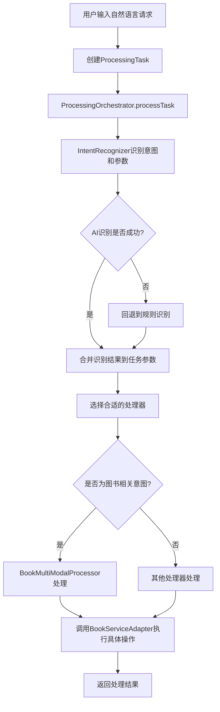

# AI图书借阅系统架构设计与流程文档

## 1. 系统概述

AI图书借阅系统是一个基于领域驱动设计（DDD）的智能化图书管理系统，它结合了自然语言处理（NLP）技术和传统的图书管理功能，允许用户通过自然语言进行图书搜索、借阅和归还操作。系统采用模块化设计，将多模态处理和图书管理功能分离，确保了良好的可扩展性和维护性。

## 2. 系统架构

### 2.1 整体架构

系统采用分层架构设计，遵循DDD原则，主要包括以下几个边界上下文：

1. **多模态处理上下文**：负责处理用户的自然语言输入，识别用户意图和提取相关参数
2. **图书管理上下文**：负责图书管理的核心业务逻辑，包括图书搜索、借阅、归还等功能

```
┌─────────────────────────────────────────────────────────────┐
│                    接口层 (Interfaces)                      │
│  REST API控制器、Web界面等                                  │
├─────────────────────────────────────────────────────────────┤
│                    应用层 (Application)                     │
│  任务处理协调、用例编排                                     │
├─────────────────────────────────────────────────────────────┤
│                    领域层 (Domain)                          │
│  核心业务逻辑、实体、值对象、领域服务                       │
├─────────────────────────────────────────────────────────────┤
│                 基础设施层 (Infrastructure)                 │
│  数据持久化、外部服务集成、技术实现                         │
└─────────────────────────────────────────────────────────────┘
```

### 2.2 核心组件

#### 2.2.1 多模态处理模块

多模态处理模块负责解析用户的自然语言输入，识别用户意图并提取相关参数。

**主要组件：**
- `ProcessingTask`：处理任务聚合根，封装用户的请求信息
- `IntentRecognizer`：意图识别器，识别用户的具体意图
- `NlpEngine`：自然语言处理引擎接口，具体实现为`SpacyNlpEngine`
- `SpacyNlpEngine`：基于AI的NLP引擎实现，使用大语言模型识别意图和参数
- `ParameterExtractorManager`：参数提取器管理器，管理多个参数提取器
- `BookParameterExtractor`：图书相关参数提取器，专门提取图书相关参数
- `ProcessingOrchestrator`：处理编排器，协调整个处理流程

#### 2.2.2 图书管理模块

图书管理模块负责图书管理的核心业务逻辑。

**主要组件：**
- `Book`：图书实体，包含图书的基本信息
- `BorrowRecord`：借阅记录实体，记录借阅相关信息
- `BookServiceAdapter`：图书服务适配器，提供图书管理功能的具体实现
- `BookMultiModalProcessor`：图书管理多模态处理器，处理与图书管理相关的多模态请求

## 3. 系统流程

### 3.1 整体处理流程



### 3.2 意图识别流程

1. 用户通过自然语言输入请求，如"我想借《Java核心技术》，学号为2021001，姓名为张三"
2. 系统创建[ProcessingTask](file:///Users/jet/work/project/spring-ai/spring-ai-alibaba-examples/spring-ai-alibaba-playground/src/main/java/com/alibaba/cloud/ai/ddd/multimodal/domain/model/ProcessingTask.java#L26-L291)对象封装用户请求
3. [ProcessingOrchestrator](file:///Users/jet/work/project/spring-ai/spring-ai-alibaba-examples/spring-ai-alibaba-playground/src/main/java/com/alibaba/cloud/ai/ddd/multimodal/domain/service/ProcessingOrchestrator.java#L18-L255)调用[IntentRecognizer.recognizeIntentWithParameters](file:///Users/jet/work/project/spring-ai/spring-ai-alibaba-examples/spring-ai-alibaba-playground/src/main/java/com/alibaba/cloud/ai/ddd/multimodal/domain/service/IntentRecognizer.java#L48-L73)识别用户意图和参数
4. [IntentRecognizer](file:///Users/jet/work/project/spring-ai/spring-ai-alibaba-examples/spring-ai-alibaba-playground/src/main/java/com/alibaba/cloud/ai/ddd/multimodal/domain/service/IntentRecognizer.java#L12-L83)优先从任务参数中获取意图，如果不存在则使用NLP引擎识别
5. [SpacyNlpEngine](file:///Users/jet/work/project/spring-ai/spring-ai-alibaba-examples/spring-ai-alibaba-playground/src/main/java/com/alibaba/cloud/ai/ddd/multimodal/domain/service/SpacyNlpEngine.java#L19-L184)通过大语言模型识别用户意图和参数
6. [ParameterExtractorManager](file:///Users/jet/work/project/spring-ai/spring-ai-alibaba-examples/spring-ai-alibaba-playground/src/main/java/com/alibaba/cloud/ai/ddd/multimodal/domain/service/ParameterExtractorManager.java#L13-L52)使用规则提取补充参数
7. 将识别出的意图和参数合并到任务中

### 3.3 图书借阅流程

1. 用户输入借书请求，如"我想借《Java核心技术》，学号为2021001，姓名为张三"
2. 系统识别意图为[BORROW_BOOK_ACTION](file:///Users/jet/work/project/spring-ai/spring-ai-alibaba-examples/spring-ai-alibaba-playground/src/main/java/com/alibaba/cloud/ai/ddd/multimodal/domain/service/IntentRecognizer.java#L21-L21)
3. [BookMultiModalProcessor](file:///Users/jet/work/project/spring-ai/spring-ai-alibaba-examples/spring-ai-alibaba-playground/src/main/java/com/alibaba/cloud/ai/ddd/book/infrastructure/external/BookMultiModalProcessor.java#L28-L559)处理借书请求
4. 从任务参数中提取图书标题、学号和姓名
5. 通过[BookServiceAdapter.getBookIdByTitle](file:///Users/jet/work/project/spring-ai/spring-ai-alibaba-examples/spring-ai-alibaba-playground/src/main/java/com/alibaba/cloud/ai/ddd/book/infrastructure/external/BookServiceAdapter.java#L195-L206)将图书标题转换为图书ID
6. 调用[BookServiceAdapter.borrowBook](file:///Users/jet/work/project/spring-ai/spring-ai-alibaba-examples/spring-ai-alibaba-playground/src/main/java/com/alibaba/cloud/ai/ddd/book/infrastructure/external/BookServiceAdapter.java#L154-L178)执行借阅操作
7. 返回借阅成功信息

### 3.4 图书归还流程

1. 用户输入还书请求，如"我要归还《Java核心技术》，学号为2021001"
2. 系统识别意图为[RETURN_BOOK](file:///Users/jet/work/project/spring-ai/spring-ai-alibaba-examples/spring-ai-alibaba-playground/src/main/java/com/alibaba/cloud/ai/ddd/multimodal/domain/service/IntentRecognizer.java#L20-L20)
3. [BookMultiModalProcessor](file:///Users/jet/work/project/spring-ai/spring-ai-alibaba-examples/spring-ai-alibaba-playground/src/main/java/com/alibaba/cloud/ai/ddd/book/infrastructure/external/BookMultiModalProcessor.java#L28-L559)处理还书请求
4. 从任务参数中提取图书标题和学号
5. 通过[BookServiceAdapter.getBookIdByTitle](file:///Users/jet/work/project/spring-ai/spring-ai-alibaba-examples/spring-ai-alibaba-playground/src/main/java/com/alibaba/cloud/ai/ddd/book/infrastructure/external/BookServiceAdapter.java#L195-L206)将图书标题转换为图书ID
6. 调用[BookServiceAdapter.returnBook](file:///Users/jet/work/project/spring-ai/spring-ai-alibaba-examples/spring-ai-alibaba-playground/src/main/java/com/alibaba/cloud/ai/ddd/book/infrastructure/external/BookServiceAdapter.java#L181-L193)执行归还操作
7. 返回归还成功信息

## 4. 核心特性

### 4.1 智能意图识别

系统能够识别多种用户意图：
- [VIEW_AVAILABLE_BOOKS](file:///Users/jet/work/project/spring-ai/spring-ai-alibaba-examples/spring-ai-alibaba-playground/src/main/java/com/alibaba/cloud/ai/ddd/multimodal/domain/service/IntentRecognizer.java#L17-L17)：查看可借书籍
- [SEARCH_BOOKS](file:///Users/jet/work/project/spring-ai/spring-ai-alibaba-examples/spring-ai-alibaba-playground/src/main/java/com/alibaba/cloud/ai/ddd/multimodal/domain/service/IntentRecognizer.java#L18-L18)：搜索书籍
- [BORROW_BOOK_LIST](file:///Users/jet/work/project/spring-ai/spring-ai-alibaba-examples/spring-ai-alibaba-playground/src/main/java/com/alibaba/cloud/ai/ddd/multimodal/domain/service/IntentRecognizer.java#L19-L19)：查看可借书列表
- [BORROW_BOOK_ACTION](file:///Users/jet/work/project/spring-ai/spring-ai-alibaba-examples/spring-ai-alibaba-playground/src/main/java/com/alibaba/cloud/ai/ddd/multimodal/domain/service/IntentRecognizer.java#L21-L21)：执行借书操作
- [RETURN_BOOK](file:///Users/jet/work/project/spring-ai/spring-ai-alibaba-examples/spring-ai-alibaba-playground/src/main/java/com/alibaba/cloud/ai/ddd/multimodal/domain/service/IntentRecognizer.java#L20-L20)：归还书籍
- [GENERAL_PROCESSING](file:///Users/jet/work/project/spring-ai/spring-ai-alibaba-examples/spring-ai-alibaba-playground/src/main/java/com/alibaba/cloud/ai/ddd/multimodal/domain/service/IntentRecognizer.java#L22-L22)：一般处理

### 4.2 多种参数提取方式

系统支持通过多种方式提取参数：
- 图书ID：如"图书ID为12345"
- 图书标题：如《Java核心技术》
- 学号：如"学号为2021001"
- 学生姓名：如"姓名为张三"
- 图书类别：如"编程类"

### 4.3 灵活的处理机制

系统具有灵活的处理机制：
- 支持通过图书ID或图书标题进行借阅
- 提供回退机制，当AI识别失败时使用规则识别
- 参数提取优先使用AI识别结果，同时保留规则提取作为补充

## 5. 技术实现细节

### 5.1 意图识别实现

意图识别通过以下步骤实现：
1. 优先从任务参数中获取意图
2. 如果参数中没有意图，则使用NLP引擎识别
3. NLP引擎使用大语言模型分析用户输入
4. 提示模板指导AI模型同时输出意图和参数

### 5.2 参数提取实现

参数提取通过以下步骤实现：
1. 使用[ParameterExtractorManager](file:///Users/jet/work/project/spring-ai/spring-ai-alibaba-examples/spring-ai-alibaba-playground/src/main/java/com/alibaba/cloud/ai/ddd/multimodal/domain/service/ParameterExtractorManager.java#L13-L52)管理多个参数提取器
2. [BookParameterExtractor](file:///Users/jet/work/project/spring-ai/spring-ai-alibaba-examples/spring-ai-alibaba-playground/src/main/java/com/alibaba/cloud/ai/ddd/multimodal/domain/service/BookParameterExtractor.java#L13-L142)专门提取图书相关参数
3. 使用正则表达式提取具体参数值
4. 将AI识别的参数和规则提取的参数合并

### 5.3 处理编排实现

处理编排通过以下步骤实现：
1. [ProcessingOrchestrator](file:///Users/jet/work/project/spring-ai/spring-ai-alibaba-examples/spring-ai-alibaba-playground/src/main/java/com/alibaba/cloud/ai/ddd/multimodal/domain/service/ProcessingOrchestrator.java#L18-L255)统一协调处理流程
2. 根据识别出的意图选择合适的处理器
3. 将任务参数传递给处理器
4. 处理器执行具体业务逻辑并返回结果

## 6. 系统优势

### 6.1 用户体验优势

- 支持自然语言交互，用户无需学习复杂的命令
- 支持多种参数输入方式，提高使用便利性
- 提供清晰的反馈信息，让用户了解操作结果

### 6.2 技术架构优势

- 采用DDD架构，模块划分清晰，易于维护和扩展
- 使用策略模式和依赖注入，提高代码灵活性
- 提供回退机制，确保系统稳定性
- 参数化意图传递，提高系统可配置性

### 6.3 可扩展性优势

- 模块化设计，易于添加新的功能模块
- 支持添加新的参数提取器，扩展参数识别能力
- 可以集成不同的NLP引擎，提高意图识别准确性
- 支持添加新的处理器，处理不同类型的请求