# Spring AI Alibaba Playground 项目核心调用图

## 1. 整体架构概览

本项目采用领域驱动设计（DDD）架构，主要分为两个边界上下文：
1. **多模态处理上下文** - 负责处理用户的自然语言输入
2. **图书管理上下文** - 负责图书管理的核心业务逻辑

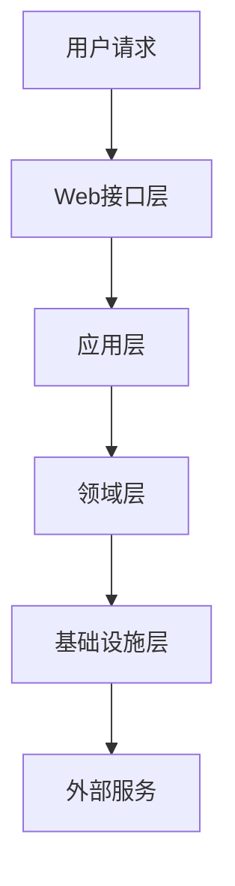

## 2. 核心组件调用关系

### 2.1 Web接口层调用关系

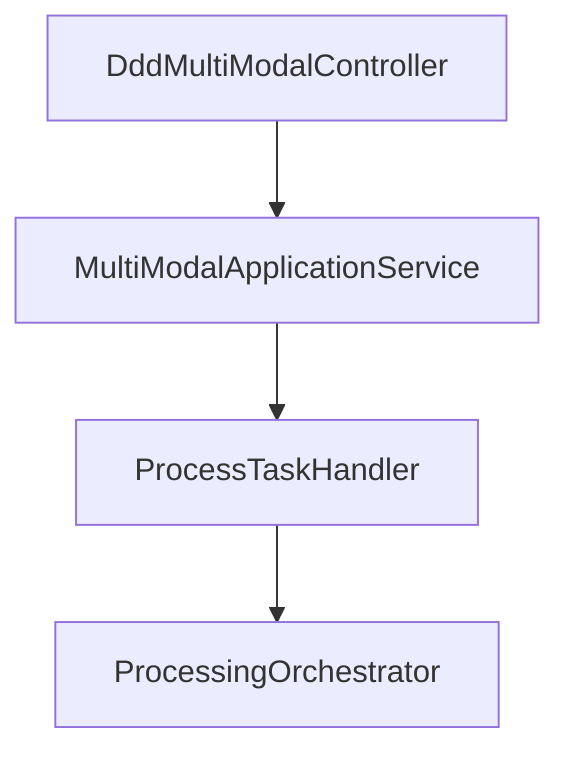

### 2.2 多模态处理核心调用链

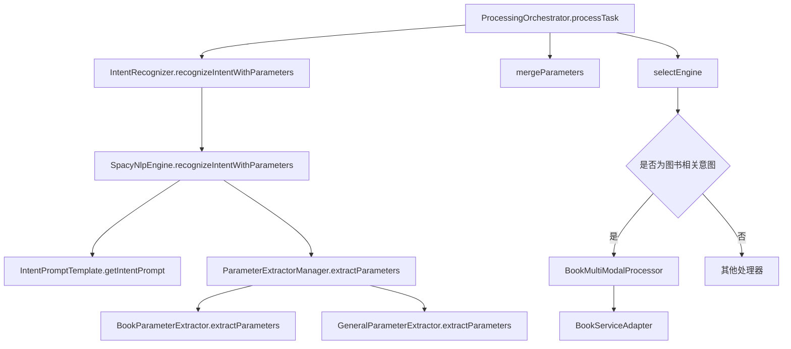

### 2.3 图书管理调用链

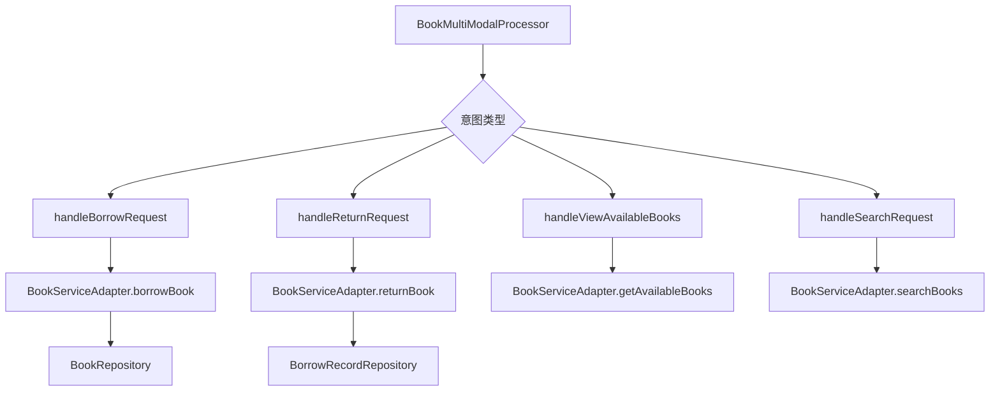

## 3. 详细调用图

### 3.1 请求处理流程

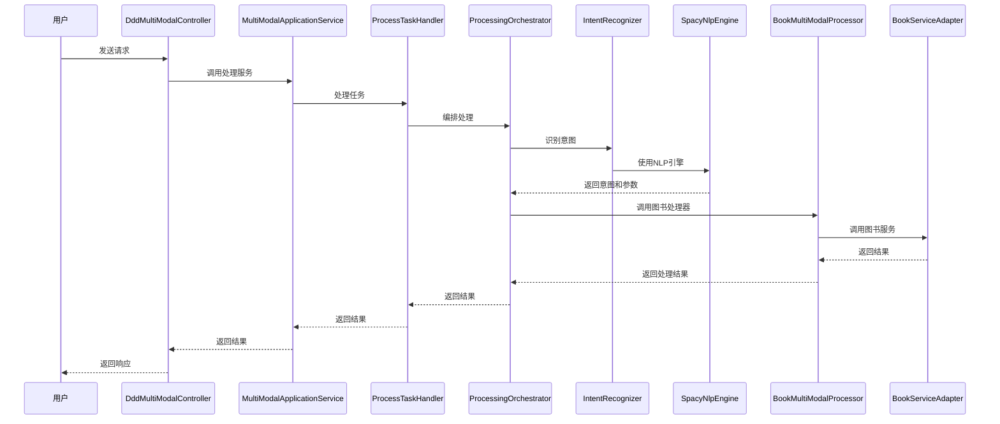

### 3.2 意图识别流程

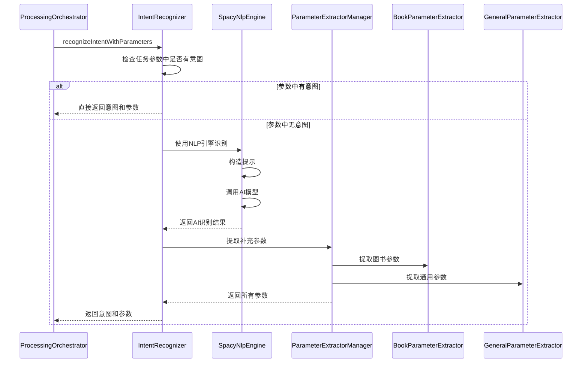

### 3.3 图书借阅处理流程

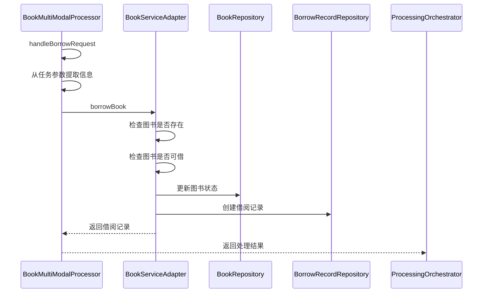

## 4. 关键类和方法调用关系

### 4.1 ProcessingOrchestrator 核心调用

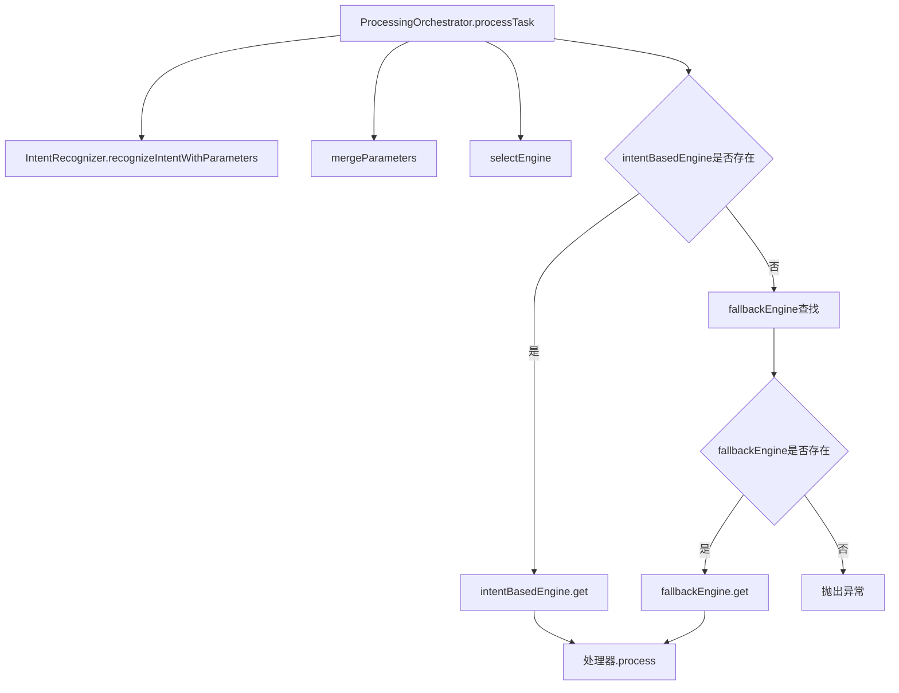

### 4.2 BookMultiModalProcessor 核心调用

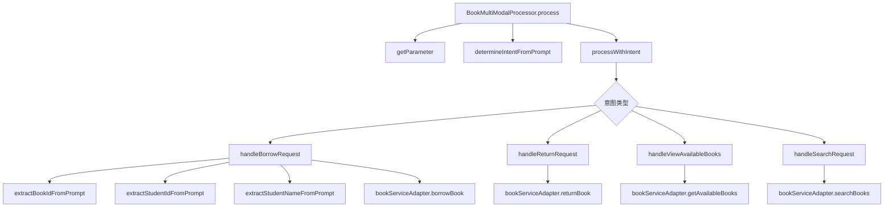

### 4.3 SpacyNlpEngine 核心调用

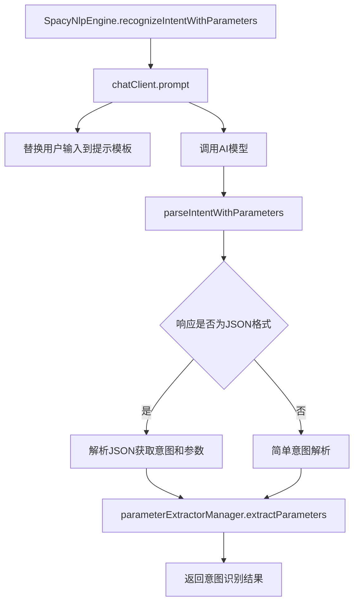

## 5. 数据流向图

### 5.1 用户请求数据流向

### 5.2 图书借阅数据流向

## 6. 异常处理流程

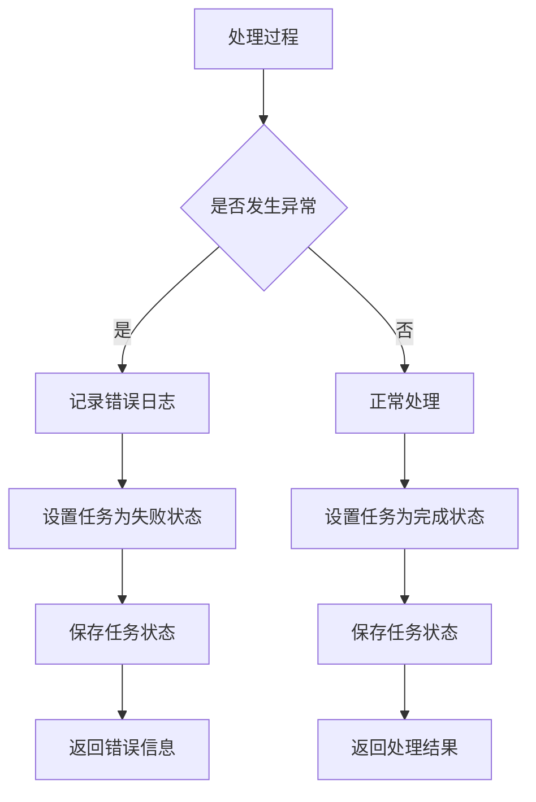

## 7. 系统组件依赖关系

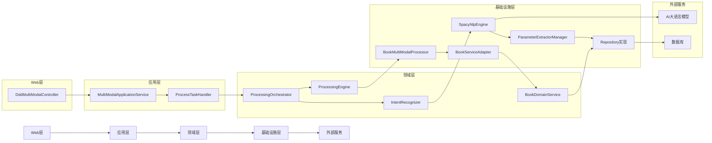

## 8. 关键设计模式应用

### 8.1 策略模式

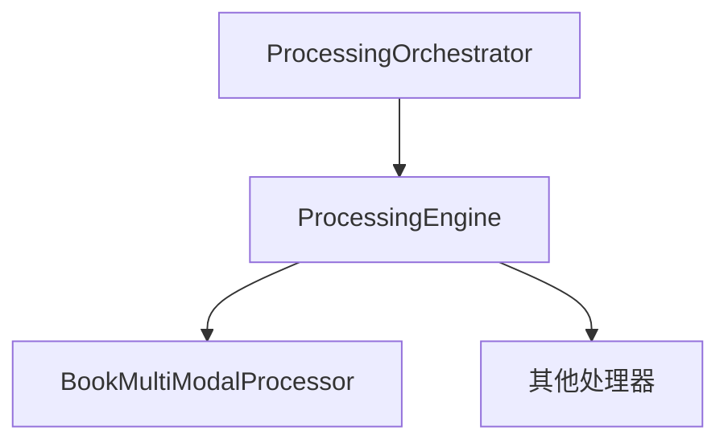

### 8.2 工厂模式

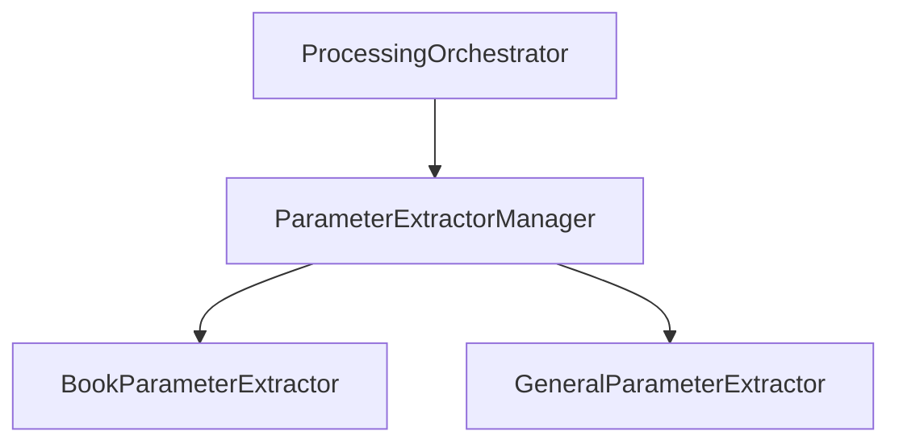

### 8.3 装饰器模式

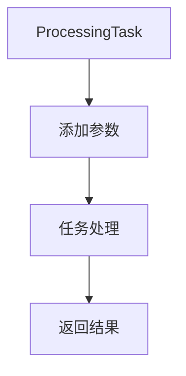

## 9. 性能优化点

1. **意图缓存** - 优先从任务参数中获取意图，避免重复的NLP处理
2. **参数复用** - 意图识别阶段提取的参数直接传递给处理器使用
3. **回退机制** - AI识别失败时使用规则识别作为回退方案
4. **响应式处理** - 使用Reactor框架实现非阻塞异步处理

## 10. 可扩展性设计

1. **插件化处理器** - 通过ProcessingEngine接口支持添加新的处理器
2. **参数提取器链** - 通过ParameterExtractorManager管理参数提取器链
3. **意图支持策略** - 通过IntentSupportStrategy支持不同领域的意图处理
4. **NLP引擎抽象** - 通过NlpEngine接口支持不同的NLP实现